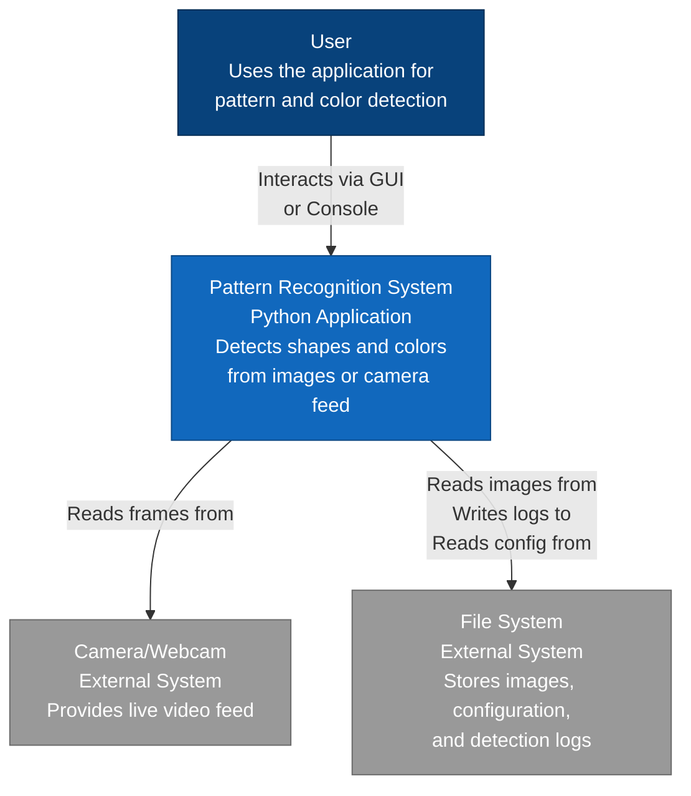
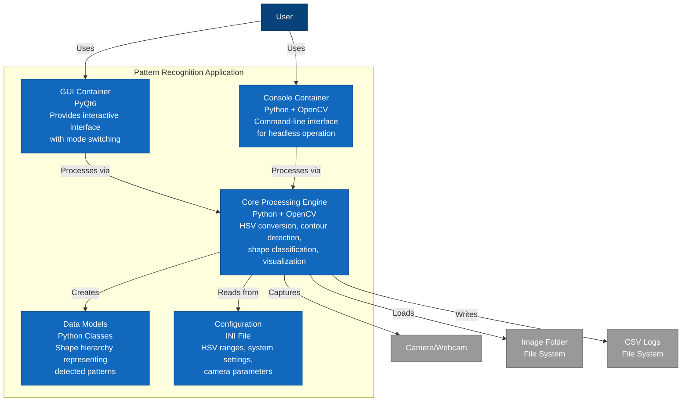
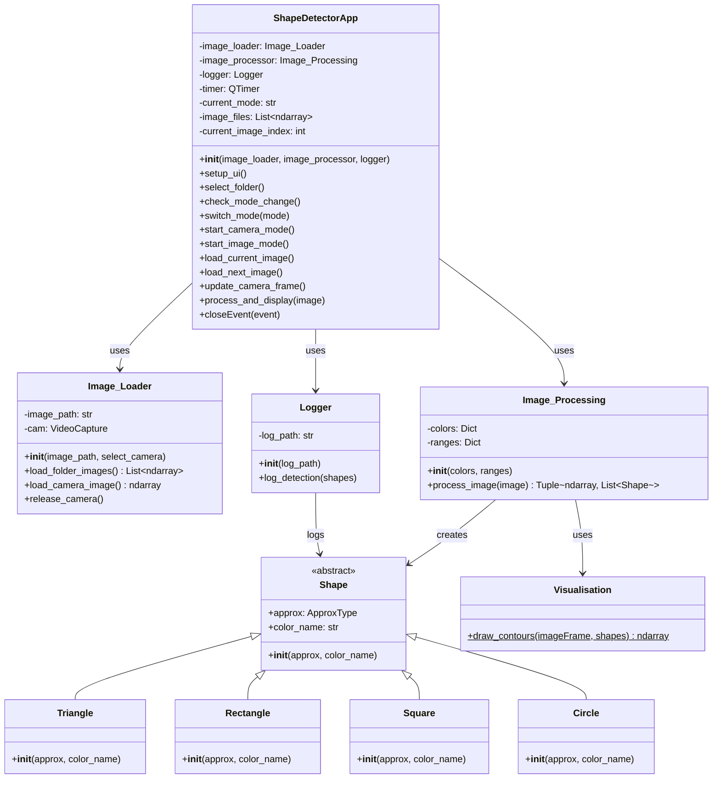
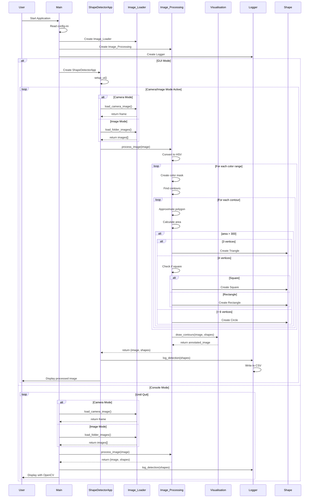

# Software Engineering Project: Pattern Recognition 

## Table of Contents

- [Purpose of this Project](#purpose-of-this-project)
  - [Key Features](#key-features)
- [System Requirements](#system-requirements)
  - [Software Requirements](#software-requirements)
  - [Dependencies](#dependencies)
  - [Hardware Requirements](#hardware-requirements)
- [Project Setup](#project-setup)
- [Configuration](#configuration)
  - [settings](#settings)
  - [pattern_recognition](#pattern_recognition)
  - [logging](#logging)
- [Project Structure](#project-structure)
  - [Key Files Description](#key-files-description)
- [Architecture](#architecture)
  - [C4 Model - Context & Container Diagrams](#c4-model---context--container-diagrams)
  - [Static View - Class Diagram](#static-view---class-diagram)
  - [Dynamic View - Sequence Diagram](#dynamic-view---sequence-diagram)

## Purpose of this Project

This project was developed as part of the **Software Engineering** course and implements a Python-based computer vision application for real-time pattern and color recognition. The system can identify geometric shapes (circles, rectangles, squares, and triangles) and their associated colors (red, green, blue, yellow and violet) from visual input.

### Key Features

- **Dual Input Modes**: Process images from a live camera feed or from a folder of static images
- **Shape Detection**: Recognizes circles, rectangles, squares, and triangles using contour approximation
- **Color Recognition**: Identifies five base colors (red, green, blue, yellow and violet) through HSV color space filtering
- **Visual Feedback**: Highlights detected patterns directly on the processed images
- **Automated Logging**: Records all detections with their shape type and color to a CSV file
- **Configurable Settings**: Customize color ranges and detection parameters via an external configuration file

## System Requirements

### Software Requirements

- **Python Version**: Python 3.8 or higher recommended
- **Operating System**: 
  - Windows 10/11 (tested)

### Dependencies

The project requires the following key libraries (all listed in [requirements.txt](requirements.txt)):

- **opencv-python** (4.12.0.88): Core computer vision functionality for image processing and contour detection
- **PyQt6**: GUI framework for the interactive application interface
- **numpy** (2.3.4): Numerical operations and array manipulations


### Hardware Requirements

- **Camera**: USB webcam or built-in camera for live detection mode
- **RAM**: Minimum 4GB (8GB recommended for smooth GUI operation)
- **Processor**: Modern multi-core CPU for real-time processing

## Project Setup

For the project setup, a virtual environment needs to be created. Follow the steps below to set up the venv and execute the script.

1. Navigate to your project directory in your terminal of choice.
    - VS Code is the simplest solution for this, as the terminal already opens in your project directory
2. Create your virtual environment and name it accordingly, e.g., 'virtualbox'
    - `python -m venv virtualbox`
3. Activate the virtual environment. Make sure to remain in the project directory
    - `virtualbox\Scripts\activate` (Windows)
4. Install the required libraries from requirements.txt
    - `pip install -r requirements.txt`
5. Configure the application settings in [config.ini](Python/config.ini) (see [Configuration](#configuration) section below)
6. Start the application using one of the following commands:
    - `python Python\main.py` - Starts with settings from config.ini
    - `python Python\main.py GUI` - Starts in GUI mode (overrides config setting)
    - `python Python\main.py CONSOLE` - Starts in console mode (overrides config setting)
    - `python Python\main.py CONSOLE CAMERA` - Starts console mode with camera input
    - `python Python\main.py CONSOLE IMAGE` - Starts console mode with image folder input
    - **Note for VS Code users**: Ensure you select the correct Python interpreter for your virtual environment
        - Press `Ctrl + Shift + P` and type `Python: Select Interpreter`
        - Select the Python version associated with your virtual environment (e.g., the one inside `virtualbox`)
7. To deactivate the venv, enter the following command in the terminal
    - `deactivate`

## Configuration

The application behavior can be customized via [config.ini](Python/config.ini) located in the Python folder. This file contains three main sections:

### [settings]

- **camera_index**: Camera device index (default: `0` for primary camera)
- **picture_path**: Folder path for loading images (default: `Pictures`)
- **mode**: Default input mode - `image` or `camera`
- **run_mode**: Default execution mode - `GUI` or `CONSOLE`
- **fontscale**: Font size for shape labels (default: `0.75`)
- **thickness**: Line thickness for contour drawing (default: `1`)
- **text_color**: RGB color for text labels (default: `(0,0,0)` - black)
- **font**: OpenCV font type (default: `FONT_HERSHEY_COMPLEX_SMALL`)

### [pattern_recognition]

Defines HSV color ranges for shape detection. Each color has a lower and upper bound in HSV format `[Hue, Saturation, Value]`:

- **Red**: Defined with two ranges (`red1` and `red2`) due to HSV hue wrapping at 0°/180°
- **Green**: `[25, 52, 72]` to `[102, 255, 255]`
- **Blue**: `[94, 120, 120]` to `[120, 255, 255]`
- **Yellow**: `[15, 150, 20]` to `[35, 255, 255]`
- **Purple**: `[130, 100, 100]` to `[160, 255, 255]`

**Tip**: Adjust these ranges to fine-tune color detection sensitivity for different lighting conditions or camera characteristics.

### [logging]

- **path**: Output path for detection logs (default: `Output/log.csv`)

## Project Structure

The project follows a modular structure with clear separation of concerns:

```
Software_Enginering_Pattern_Recognition/
│
├── Python/                      # Main source code directory
│   ├── main.py                  # Application entry point - handles mode selection and initialization
│   ├── ShapeDetectorApp.py      # PyQt6 GUI application class
│   ├── Image_Loader.py          # Handles image acquisition from camera or folder
│   ├── Image_Processing.py      # Core vision processing - HSV conversion, contour detection, shape classification
│   ├── Shape.py                 # Shape data model hierarchy (Triangle, Rectangle, Square, Circle)
│   ├── Visualisation.py         # Rendering utilities for drawing contours and labels
│   ├── Logger.py                # CSV logging functionality for detection results
│   └── config.ini               # Configuration file for color ranges and system settings
│
├── Documents/                   # Project documentation and reports
├── Pictures/                    # Sample images for testing and demonstration
│
├── requirements.txt             # Python dependencies specification
├── README.md                    # Project documentation (this file)
└── .gitignore                   # Git ignore rules
```

### Key Files Description

- **[main.py](Python/main.py)**: Orchestrates application startup, reads configuration, and delegates to either GUI or console mode
- **[config.ini](Python/config.ini)**: Defines HSV color ranges for detection and system parameters (camera index, log path, default modes) For more Information see [Configuration](#configuration) Segment
- **[requirements.txt](requirements.txt)**: Lists all Python package dependencies with version specifications


## Architecture

The architecture of this pattern recognition system follows object-oriented design principles with clear separation of concerns. The application is structured into distinct layers: data acquisition (Image_Loader), processing logic (Image_Processing, Visualisation), data models (Shape hierarchy), persistence (Logger), and presentation (ShapeDetectorApp for GUI, main.py for console mode).

This modular architecture enables flexibility in input sources (camera or folder), processing pipelines, and output modes (GUI or console), while maintaining a clean dependency structure where each component has a well-defined responsibility.

### C4 Model - Context & Container Diagrams

#### System Context Diagram

The System Context diagram shows the Pattern Recognition Application and its interactions with users and external systems.



#### Container Diagram

The Container diagram shows the high-level technology choices and how the application is structured.



**Key Architectural Decisions:**

- **Dual Interface Strategy**: Separate GUI (PyQt6) and Console containers enable both interactive and automated usage scenarios
- **Centralized Processing Core**: Shared processing engine ensures consistent detection logic across both interfaces
- **Configuration-Driven Design**: External config.ini allows runtime customization without code changes
- **HSV Color Space**: Chosen for robust color detection under varying lighting conditions
- **CSV Logging**: Simple, portable format for detection results suitable for data analysis

### Static View - Class Diagram



#### Class Responsibilities

**Data Models:**
- **Shape (Abstract)**: Base class for all geometric shapes, storing contour approximation and color information
- **Triangle, Rectangle, Square, Circle**: Concrete shape implementations inheriting from Shape

**Core Processing:**
- **Image_Loader**: Manages image acquisition from both camera streams and folder-based image collections
- **Image_Processing**: Core vision processing - converts images to HSV color space, applies color masks, detects contours, and classifies shapes
- **Visualisation**: Renders detected shapes and their labels onto processed images

**Application Layer:**
- **ShapeDetectorApp**: PyQt6-based GUI providing interactive mode switching, folder selection, and real-time visualization
- **Logger**: Persists detection results to CSV files for analysis and record-keeping

**Dependencies:**
The architecture maintains a unidirectional dependency flow: ShapeDetectorApp orchestrates Image_Loader, Image_Processing, and Logger; Image_Processing creates Shape instances and utilizes Visualisation for rendering; Logger references Shape objects for persistence.

### Dynamic View - Sequence Diagram

The sequence diagram illustrates the runtime behavior of the application in both GUI and console modes. The flow begins with initialization where the main module reads configuration settings and instantiates the core components (Image_Loader, Image_Processing, Logger).

In **GUI mode**, the ShapeDetectorApp orchestrates continuous processing loops that acquire images (from camera or folder), pass them through the image processing pipeline, and display results. The Image_Processing component performs the core computer vision workflow: HSV conversion, color-based masking, contour detection, polygon approximation, and shape classification. For each detected shape meeting the area threshold, appropriate Shape objects are instantiated. The Visualisation utility then annotates the image with bounding contours and labels before display.

In **console mode**, the main module directly manages the processing loop and uses OpenCV windows for display instead of a GUI framework.

Both modes follow the same core processing pipeline and log all detections to CSV through the Logger component, ensuring consistent behavior regardless of interface choice.


