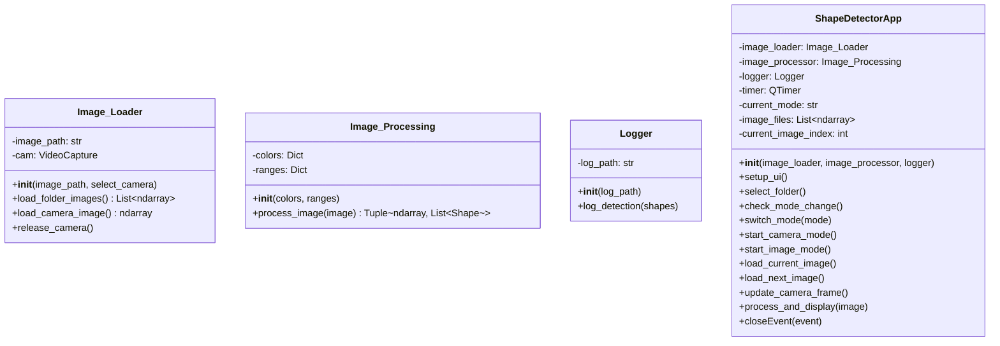

# Software Engineering Pattern Recognition Project

## Purpose of this Project

This project implements a Python-based computer vision application for real-time pattern and color recognition. The system can identify geometric shapes (circles, rectangles, squares, and triangles) and their associated colors (red, green, blue, yellow and violet) from visual input.

### Key Features

- **Dual Input Modes**: Process images from a live camera feed or from a folder of static images
- **Shape Detection**: Recognizes circles, rectangles, squares, and triangles using contour approximation
- **Color Recognition**: Identifies five base colors (red, green, blue, yellow and violet) through HSV color space filtering
- **Visual Feedback**: Highlights detected patterns directly on the processed images
- **Automated Logging**: Records all detections with their shape type and color to a CSV file
- **Configurable Settings**: Customize color ranges and detection parameters via an external configuration file

## Project Setup

For the project setup, a virtual environment needs to be created. Follow the steps below to set up the venv and execute the script.

1. Navigate to your project directory in your terminal of choice.
    - VS Code is the simplest solution for this, as the terminal already opens in your project directory
2. Create your virtual environment and name it accordingly, e.g., 'virtualbox'
    - `python -m venv virtualbox`
3. Activate the virtual environment. Make sure to remain in the project directory
    - `virtualbox\Scripts\activate` (Windows)
4. Install the required libraries from requirements.txt
    - `pip install -r requirements.txt`
5. Now you are ready to start the project by executing main.py
    - `python main.py`
    - **Note for VS Code users**: Ensure you select the correct Python interpreter for your virtual environment
        - Press `Ctrl + Shift + P` and type `Python: Select Interpreter`
        - Select the Python version associated with your virtual environment (e.g., the one inside `virtualbox`)
6. To deactivate the venv, enter the following command in the terminal
    - `deactivate`

## Architecture

### Static View - Class Diagram

